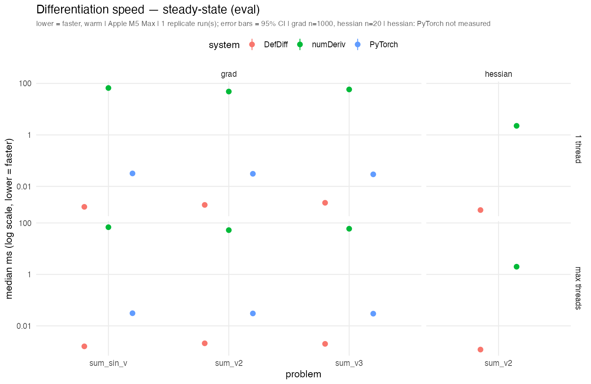
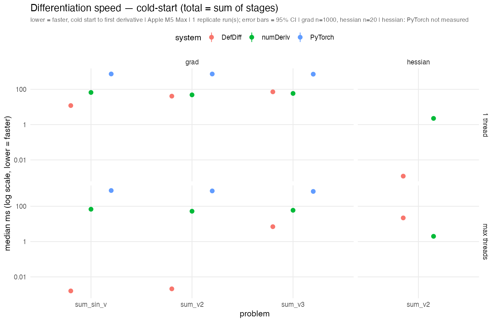

# DefDiff-benchmark — community differentiation speed benchmark

Companion benchmark for [**PsychQuantR/DefDiff**](https://github.com/PsychQuantR/DefDiff). It compares the speed of differentiation systems — DefDiff, numDeriv, and (when installed) PyTorch and JAX — on contributors' own machines, and publishes the results as a community leaderboard.

Timing is reported **per stage** (cold-start `import` / `build` / `jit_compile` through steady-state `eval`, plus an end-to-end `total`) and across **single- vs multi-thread** settings. Each run also records its full hardware/environment provenance.

The data is **observational** — each contributor is one machine, so hardware is confounded with contributor. It is summarized with a mixed-effects model (machine as a random effect), never as a balanced factorial.

## Requirements

- An installed DefDiff package: `remotes::install_github("PsychQuantR/DefDiff")` (macOS; the differentiation operators being benchmarked link Accelerate / Metal).
- `numDeriv`, `jsonlite`, and `bench` (R). `lme4` for the analysis; `ggplot2` + `scales` for the charts (`ragg` optional, for crisper text). `RhpcBLASctl` is optional (thread pinning).
- Optional: Python 3 with `torch` and/or `jax` on `PATH` to include those systems.

## Contributing a run

1. Install DefDiff (above) and clone this repo.
2. Run the harness:

   ```sh
   Rscript run-community-benchmark.R --append
   ```

   This writes one self-contained log file `community-logs/<run_id>.json` (your machine's provenance plus every measurement). It is the **source of truth**; the CSV and the table below are derived from the logs.
3. Open a pull request adding **just that one log file**. One log file per run means pull requests never conflict.
4. A maintainer merges it and regenerates the CSV and the leaderboard with `make leaderboard`.

## Data flow

```
run-community-benchmark.R  ->  community-logs/<run_id>.json   (raw, source of truth, PR'd)
        DefDiff::parse_benchmark_logs  ->  community-benchmark.csv   (derived)
        DefDiff::bench_render_leaderboard  ->  the table below
analyze-community-benchmark.R  ->  lme4 mixed model (lm fallback < 5 machines)
```

`make leaderboard` runs the parse + render steps via the DefDiff package API. `Rscript analyze-community-benchmark.R` fits the mixed-effects model over the accumulated CSV.

Each run also records the machine's load during the run (CPU load average, free memory, thermal throttle) — sampled every ~2s by `sampler.sh` and stored in the run-log's `meta.load` (provenance only; not flattened into the CSV or leaderboard). Replication cancels random timing noise, but a run taken under heavy background load is biased the same way every replicate; `meta.load` lets such a run be spotted and excluded after the fact.

## Leaderboard

Median ms per system × problem, on a log scale (lower = faster). Two views: **steady-state** (`eval`, once warm) and **cold-start** (`total` = sum of all startup + eval stages, so PyTorch's `import`/`trace` cost shows). Points are the mean of per-run medians across replicate runs; error bars are 95% CIs — overlapping CIs (e.g. across thread settings) honestly say "no difference here". Regenerated by `make leaderboard` (table + charts) or `make chart` (charts only).

### Steady-state (eval)



### Cold-start (total)



### Table

<!-- BENCHMARK-LEADERBOARD:BEGIN -->

| Chip | System | Operation | Problem | n | Threads | eval median (ms) |
|---|---|---|---|---|---|---|
| Apple M5 Max | DefDiff | grad | sum_sin_v | 1e+03 | 1 | 0.002 |
| Apple M5 Max | DefDiff | grad | sum_sin_v | 1e+03 | max | 0.002 |
| Apple M5 Max | PyTorch | grad | sum_sin_v | 1e+03 | max | 0.031 |
| Apple M5 Max | PyTorch | grad | sum_sin_v | 1e+03 | 1 | 0.032 |
| Apple M5 Max | numDeriv | grad | sum_sin_v | 1e+03 | 1 | 66.465 |
| Apple M5 Max | numDeriv | grad | sum_sin_v | 1e+03 | max | 68.350 |
| Apple M5 Max | DefDiff | grad | sum_v2 | 1e+03 | 1 | 0.002 |
| Apple M5 Max | DefDiff | grad | sum_v2 | 1e+03 | max | 0.002 |
| Apple M5 Max | PyTorch | grad | sum_v2 | 1e+03 | max | 0.030 |
| Apple M5 Max | PyTorch | grad | sum_v2 | 1e+03 | 1 | 0.031 |
| Apple M5 Max | numDeriv | grad | sum_v2 | 1e+03 | 1 | 48.428 |
| Apple M5 Max | numDeriv | grad | sum_v2 | 1e+03 | max | 52.568 |
| Apple M5 Max | DefDiff | grad | sum_v3 | 1e+03 | max | 0.002 |
| Apple M5 Max | DefDiff | grad | sum_v3 | 1e+03 | 1 | 0.002 |
| Apple M5 Max | PyTorch | grad | sum_v3 | 1e+03 | 1 | 0.029 |
| Apple M5 Max | PyTorch | grad | sum_v3 | 1e+03 | max | 0.030 |
| Apple M5 Max | numDeriv | grad | sum_v3 | 1e+03 | 1 | 58.362 |
| Apple M5 Max | numDeriv | grad | sum_v3 | 1e+03 | max | 59.554 |
| Apple M5 Max | DefDiff | hessian | sum_v2 | 2e+01 | 1 | 0.001 |
| Apple M5 Max | DefDiff | hessian | sum_v2 | 2e+01 | max | 0.001 |
| Apple M5 Max | numDeriv | hessian | sum_v2 | 2e+01 | max | 1.992 |
| Apple M5 Max | numDeriv | hessian | sum_v2 | 2e+01 | 1 | 2.249 |

<!-- BENCHMARK-LEADERBOARD:END -->
